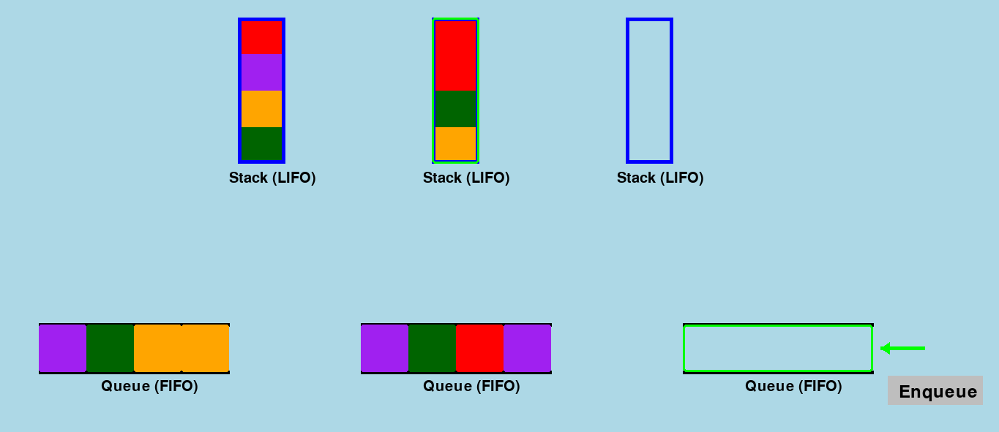

# Introduction

## <u>Concepts taught:</u>
Basic Queue Operations (Dequeue, Enqueue) &
Stack Operations (Pop, Push)

## <u>Objectives & how to play</u>
- There are 5 stacks <b>(LIFO)</b> and 2 queues <b>(FIFO)</b>

- Click on stacks/queues which contains a color block and move them around using Basic Operationns Buttons
(in this example, a stack is clicked and the <b>pop</b> button appears)

- Afterwards I click on a queue to enqueue the colored block

- Goal is to have queues/stacks containing all of the specific colored blocks

---
## Example
You can [play the water sorting game here.](https://scepticfire.github.io/FYP-Water-Sorting-Game/)
